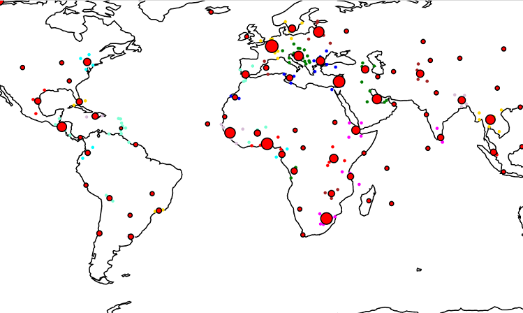
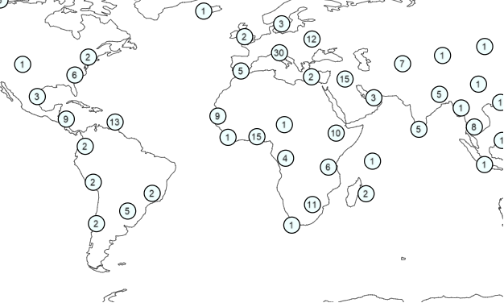

## **Marker Cluster Symbolizer**
The Marker Cluster Symbolizer is one of advanced symbolizers. It allows the clustering of markers in the specified distance.

In this C# example, we have drawn cluster centers as red circles. Also, we have drawn all nested cluster points by using different colors. To do this, we used the FeaturesBasedConfiguration function, which setups own style for each cluster.



Here’s the result:

## **Draw Total Of Items**

This sample displays total of items in the cluster.



Here’s the result:

