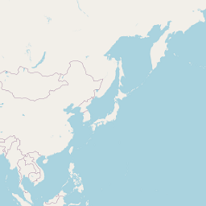
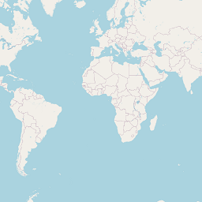

## **Working with XYZ Tiles**
The XYZ Tile ("Slippy Map") is an approach for building mapping on the web. The world map is divided into parts called tiles. All tiles are stored in Web Mapping Service tile services like Openstreetmaps, Google Hybrid, Bing, OpenCycleMap, Thunderforest, etc. And Aspose.GIS C# library lets you work with the XYZ Tiles.
### **Render one xyz tile**


### **Render xyz tiles by extent**


### **Open xyz tile from folder**

