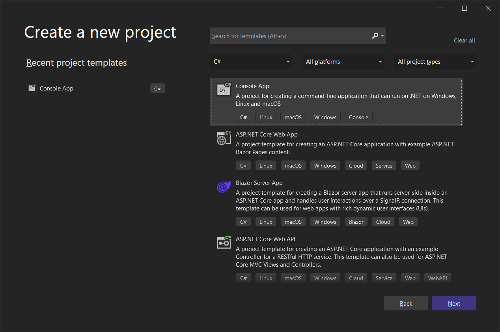
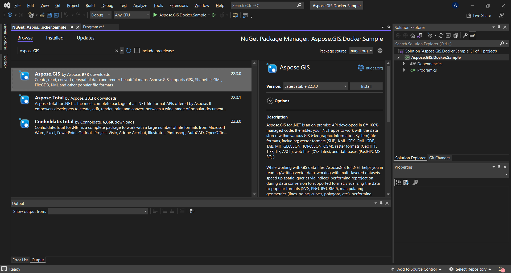

## Prerequisites

- Docker must be installed on your system. For information on how to install Docker on Windows or Mac, refer to the links in the "See Also" section.

- Visual Studio 2022.

- NET Core 3.1 SDK is used in the example.

## Hello World Application

In this example, you create a simple Hello World console application that creates a compound curve and save it in files. The application can then be built and run in Docker.

### Creating the Console Application

To create the Hello World program, follow the steps below:
1. Once Docker is installed, make sure that it uses Linux Containers (default). If necessary, select the Switch to Linux containers option from the Docker Desktops menu.
1. In Visual Studio, create a NET Core 3.1 console application. 
 
1. Install the latest Aspose.GIS version from NuGet. 
 
1. Since the application will be run on Linux, the appropriate native Linux assets must be installed. Start with the dotnet core sdk 3.1 base image and install libgdiplus libc6-dev.
1. When all required dependencies are added, write a simple program that creates a compound curve: 
**.NET** 

using System.IO;
using Aspose.Gis.Geometries;
using Aspose.Gis;

namespace Aspose.GIS.Docker.Sample
{
    internal class Program
    {
        static void Main(string[] args)
        {
            string path = Path.Combine("TestOut", "CreateCompoundCurve_out.shp");
            using (VectorLayer layer = VectorLayer.Create(path, Drivers.Shapefile))
            {
                var feature = layer.ConstructFeature();
                // create an 'S' letter (starts at bottom left end)
                var compoundCurve = new CompoundCurve();

                var bottom = (ILineString)Geometry.FromText("LineString (0 0, 3 0)");
                var firstArc = (ICircularString)Geometry.FromText("CircularString (3 0, 4 1, 3 2)");
                var middle = (ILineString)Geometry.FromText("LineString (3 2, 1 2)");
                var secondArc = (ICircularString)Geometry.FromText("CircularString (1 2, 0 3, 1 4)");
                var top = (ILineString)Geometry.FromText("LineString (1 4, 4 4)");

                compoundCurve.AddCurve(bottom);
                compoundCurve.AddCurve(firstArc);
                compoundCurve.AddCurve(middle);
                compoundCurve.AddCurve(secondArc);
                compoundCurve.AddCurve(top);
                feature.Geometry = compoundCurve;

                layer.Add(feature);
            }
        }
    }
}


Note that the “TestOut” folder is specified as an output folder for saving output documents. When running the application in Docker, a folder on the host machine will be mounted to this folder in the container. This will enable you to easily view the output generated by Aspose.GIS in the Docker container.

### Configuring a Dockerfile

The next step is to create and configure the Dockerfile.

1. Create the Dockerfile and place it next to the solution file of your application. Keep this file name without extension (the default).
1. In the Dockerfile, specify:


FROM mcr.microsoft.com/dotnet/core/sdk:3.1-buster 
WORKDIR /app
COPY . ./
RUN apt-get update && \
    apt-get install -y --allow-unauthenticated libgdiplus libc6-dev
RUN dotnet publish "Aspose.GIS.Docker.Sample.csproj" -c Release -o /app/out
ENTRYPOINT ["dotnet", "out/Aspose.GIS.Docker.Sample.dll"]


The above is a simple Dockerfile, which contains the following instructions:

- The SDK image to be used. Here it is the Net 3.1 image. Docker will download it when the build is run. The version of SDK is specified as a tag.
- The working directory, which is specified in the next line.
- The command to install libgdiplus is run in the container. This is required by System.Drawing.Common.
- The command to copy everything to container, publish the application, and specify the entry point.

### Building and Running the Application in Docker

Now the application can be built and run in Docker. Open your favorite command prompt, change directory to the folder with the application (folder where the solution file and the Dockerfile are placed) and run the following command:


docker build -t dockerfile .


The first time this command is executed it may take longer, since Docker needs to download the required images. Once the previous command is completed, run the following command:


docker run --mount type=bind,source=C:\Temp,target=/app/TestOut --rm dockerfile from Docker


{} 

Pay attention to the mount argument, because, as mentioned earlier, a folder on the host machine is mounted into the container’s folder, to easily see the results of the application execution. Paths in Linux are case sensitive.

{}

## More Examples

For more samples of how you can use Aspose.GIS in Docker, see the [examples](https://github.com/aspose-gis/Aspose.Gis-for-.NET).

## See Also

- [Install Docker Desktop on Windows](https://docs.docker.com/docker-for-windows/install/)
- [Install Docker Desktop on Mac](https://docs.docker.com/docker-for-mac/install/)
- [Visual Studio 2022, NET 3.1 SDK](https://docs.microsoft.com/en-us/dotnet/core/install/windows?tabs=netcore31#dependencies)
- [Switch to Linux containers](https://docs.docker.com/docker-for-windows/#switch-between-windows-and-linux-containers) option
- Additional information on [.NET Core SDK](https://hub.docker.com/_/microsoft-dotnet-sdk)
