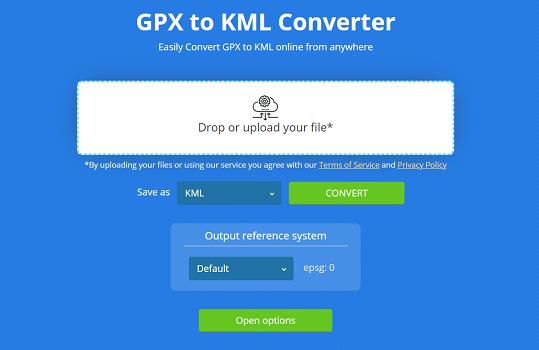

Use the Aspose.GIS for .NET library to convert to Shapefile file format from other popular vector-based gis files.

## **Live Example**

Aspose.GIS for .NET / C# presents you online free the ["Convert to Shapefile"](https://products.aspose.app/gis/conversion/convert-to-shapefile) application, where you may to investigate the functionality and quality it works.

## **Code sample - Convert to Shapefile**

The following code snippet shows you how to convert to Shapefile. If you specify a spatial reference system for the destination Shapefile layer, all geometries will be converted to it. 



This sample show general possibilities. Aspose.GIS for .NET has wide options to [convert files](https://docs.aspose.com/gis/net/vector-layers/). Each vector-based format has its own read/write options which is inherited from the [DriverOptions](https://reference.aspose.com/gis/net/aspose.gis/driveroptions) class.

## **Platform - .NET / C#**

We supports Framework 4.7 or later under Windows, and .NET Core 2.0 or later under Windows or Linux
