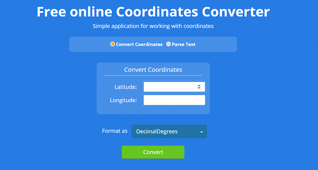

Use the Aspose.GIS for .NET library to calculate a position in a Decimal Degree Minutes (DDM) format. The [GeoConvert class](https://reference.aspose.com/gis/net/aspose.gis/geoconvert) allows you to convert Latitude/Longitude coordinates to DDM format and vice versa.

## **Live Example**

Aspose.GIS for .NET / C# presents you online free the ["Convert to DDM"](https://products.aspose.app/gis/coordinates/convert-to-ddm) application, where you may to investigate the functionality and quality it works.

## **Code sample - Convert to DDM**

The following code snippet shows you how to convert to DDM (Decimal Degree Minutes).



## **Platform - .NET / C#**

We supports Framework 4.7 or later under Windows, and .NET Core 2.0 or later under Windows or Linux
