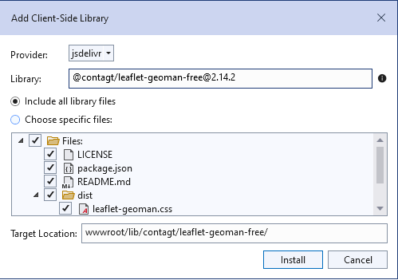
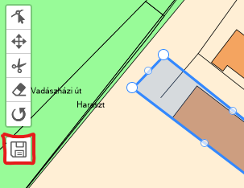
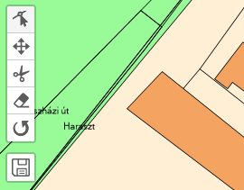

# Aspose.GIS Updates: Editing Features and Geometries and saving changes to the database.

## Introduction

In light of the recent changes in the [Aspose.GIS](https://www.nuget.org/packages/Aspose.gis) library, it is important to highlight some of them so they do not go unnoticed. In this article, we will discuss the new capability to detect and save changes to geometries and features in the database.

As an example for demonstration, we will continue working on the application described in the article ["Draw a map. A sliding map with tiles"](https://docs.aspose.com/gis/net/showcases/sliding-map-with-tiles/) and slightly expand it by adding object editing functionalities on the map. The dataset remains the same as in the previous article.

## Front-end

For the demonstration of geometry modification capabilities, we chose a popular open-source extension for [leaflet](https://leafletjs.com/) — [leaflet-geoman](https://geoman.io/).

We add this library via the libman.json file:


Next, we connect the styles and scripts to the page:
```razor
@section Styles {
    <link href="~/lib/leaflet/leaflet.min.css" rel="stylesheet" />
    <link href="~/lib/contagt/leaflet-geoman-free/dist/leaflet-geoman.min.css" rel="stylesheet" />
    <link href="~/css/map.css" rel="stylesheet" asp-append-version="true"/>
}

@section Scripts {
    <script src="~/lib/leaflet/leaflet.js"></script>
    <script src="~/lib/contagt/leaflet-geoman-free/dist/leaflet-geoman.min.js"></script>
    <script src="~/js/map.js" asp-append-version="true"></script>
}
```

For demonstration purposes, we will limit editing capabilities to buildings only. The user clicks the left mouse button on the map, and if there is a building at that location, it gets highlighted and becomes available for editing. This is achieved by overlaying an additional layer on top of the tiles.

When the user clicks on the map, the Leaflet library calculates the geospatial coordinates of the click. We send these coordinates to the back-end and search the database for geometries that intersect with the clicked point. If there are buildings among these geometries, we return them.

The buildings are returned from the back-end in `GeoJSON` format and added to the map as a separate layer for editing. Here’s how we handle the click:
```javascript
var featuresLayer = L.featureGroup().addTo(map);

map.on('click', function (e) {
    var latlng = e.latlng;
    var featureFound = false;

    console.log(latlng.lat + ' ' + latlng.lng);

    featuresLayer.eachLayer(function (layer) {
        if (layer.getBounds && layer.getBounds().contains(latlng)) {
            featureFound = true;
            return;
        }
    });

    if (!featureFound) {
        loadGeoJSON(latlng.lat, latlng.lng)
            .then((addedFeatureLayer) => {
                if (addedFeatureLayer) {
                    addedFeatureLayer.addTo(featuresLayer);
                    addedFeatureLayer.pm.enable();
                    console.log('Feature added.');
                } else {
                    console.log('No feature to add.');
                }
            });
    }

    featureFound = false;
});
```

We have a persistent layer group for editable geometries, `featuresLayer`, which has been added to the map. We check if the click was made on an already loaded geometry, and if not, we make a request to the back-end to load the polygons representing buildings. The loaded feature layers are added to featuresLayer, and the editing mode is activated. 

Here's what the function for loading features and converting from `GeoJSON` looks like:
```javascript
function loadGeoJSON(lat, lng) {
    return fetch(`/features?lat=${lat}&lng=${lng}`)
        .then(response => response.json())
        .then(data => {
            if (data && data.features && data.features.length > 0) {
                return L.geoJSON(data);
                
            } else {
                return null;
            }
        })
        .catch(error => console.error('Error loading a feature:', error));
}
```

After the editing session, the user clicks a custom `Save` button:



Refresh the page and see the changes:



Unfortunately, the `tiles.redraw()` function does not work properly as previously loaded tiles are cached, requiring a forced refresh of the map via `Ctrl + F5`.

Here is the handler for pressing the save button:
```javascript
function saveResult() {
    if (featuresLayer.getLayers().length === 0) {
        console.log('There are no layers to send to the server.');
        return;
    }
    sendGeoJSONToServer()
        .then(() => {
            console.log('clear and update map');
            featuresLayer.clearLayers();
            tiles.redraw();
        });
}

function sendGeoJSONToServer() {
    var geojsonData = featuresLayer.toGeoJSON();

    return fetch('/features', {
        method: 'POST',
        headers: {
            'Content-Type': 'application/geo+json'
        },
        body: JSON.stringify(geojsonData)
    })
        .then(data => {
            console.log('The data has been successfully sent to the server.');
        })
        .catch(error => {
            console.error('Error when sending GeoJSON:', error);
        });
}
```

## Back-end

Here we add a new controller, `FeaturesController`, where we create a handler for extracting houses/features according to the sent coordinates. 

The SQL request looks as follows:

```csharp
            var latitude = lat.ToString(CultureInfo.InvariantCulture);
            var longitude = lng.ToString(CultureInfo.InvariantCulture);
            var query = $@"SELECT osm_id, building, name, ST_AsEWKB(way) as way
                        FROM public.planet_osm_polygon
                        WHERE ST_Intersects(way, ST_Transform(ST_SetSRID(ST_MakePoint({longitude}, {latitude}), 4326), 3857)) AND building IS NOT NULL";
```

The coordinates are transformed into a point, indicating the coordinate system of the original client request (WGS 84), and then translated into the system in which the database data is presented (Web Mercator). We look for intersections with this point for geometries marked as buildings.

The execution of the request and sending data to the client occurs similarly to what we discussed in previous article:
```csharp
VectorLayer inputLayer;

using (var conn = new NpgsqlConnection("Host=127.0.0.1;Username=gis;Password=password;Database=Hungary"))
{
    var dataSource = Drivers.PostGis
        .FromQuery(query)
        .GeometryField("way")
        .AddAttribute("osm_id", AttributeDataType.Long)
        .AddAttribute("name", AttributeDataType.String)
        .AddAttribute("building", AttributeDataType.String)
        .Build();

    conn.Open();

    inputLayer = await dataSource.ReadAsync(conn);
}

var jsonStream = new MemoryStream();

inputLayer.SaveTo(AbstractPath.FromStream(jsonStream), Drivers.GeoJson);

var result = Encoding.UTF8.GetString(jsonStream.ToArray());

return new ContentResult()
{
    Content = result,
    ContentType = "application/geo+json"
};
```
With a small difference: we save our InMemory layer as GeoJSON in memory as a stream, then convert it to a string and send it to the client.

Now we come to the essence of the updates in Aspose.GIS — saving changes to the database. The `Edit()` method handles this. We read the request body to fully load it into memory and read it as a stream:
```csharp
Request.EnableBuffering();
using var reader = new StreamReader(Request.Body, Encoding.UTF8);

// just buffer the body.
await reader.ReadToEndAsync(); 
Request.Body.Position = 0;
```
Next, we read the edited features in GeoJSON format:
```csharp
using (var inputLayer = VectorLayer.Open(AbstractPath.FromStream(Request.Body), Drivers.GeoJson))
```
The next step, from the sent set of features, we extract the attributes representing the unique identifiers of the corresponding features in the database. We form a request to populate a special layer for editing and construct the corresponding data source:
```csharp
var ids = string.Join(", ", inputLayer.Select(x => x.GetValue<long>("osm_id")));

var query = $@"SELECT osm_id, building, name, ST_AsEWKB(way) as way
               FROM public.planet_osm_polygon
               WHERE osm_id IN ({ids});";

var dataSource = Drivers.PostGis
    .FromQuery(query)
    .GeometryField("way")
    .AddAttribute("osm_id", AttributeDataType.Integer, System.Data.DbType.Int64)
    .AddAttribute("name", AttributeDataType.String)
    .AddAttribute("building", AttributeDataType.String)
    .AsTrackableForChanges("public.planet_osm_polygon", "osm_id", true)
    .Build();
```
Note the configuring method `AsTrackableForChanges`. This is a special method that indicates the need to create a specific data source capable of tracking changes. The first parameter specifies the table to which change requests should be sent. The second indicates which attribute will be considered the identifier for making changes to the database. The most interesting part is the third parameter. When set to True, it indicates that the layer will track the appearance of duplicates according to the second parameter and "overwrite" previously loaded features with new ones. However, in the case of editing results, i.e., adding a new feature with the same identifier, an `UPDATE` command will be generated according to the changes compared to the old value. If duplicates appear during the initialization of the layer from the database, the layer will silently overwrite them with the last value. If the third parameter is set to false, an exception will be thrown upon the appearance of duplicates, whether during initialization or editing.

Attribute names will be used as field names in the editable table. It is important to note a crucial point regarding change detection. It is essential to specify the exact data type of the attribute that will be stored in the layer for tracking changes, it must be accurate concerning newly added or modified types. For example, if we add a new feature with an `osm_id` of type `Int32`, while the specified attribute type in the layer is `Int64`, this will be treated as two different values since there is no overload of the `Equal`s method that looks like `Int64.Equals(Int32)`. In future versions, this behavior will be reviewed and corrected if possible. The third parameter type will be applied during data saving as the target data type of the database table.

Next, we connect to the database and read data from the table:
```csharp
using var conn = new NpgsqlConnection("Host=127.0.0.1;Username=gis;Password=password;Database=Hungary");
await conn.OpenAsync();
using var transaction = await conn.BeginTransactionAsync();
var editLayer = await dataSource.ReadAsync(conn, transaction);
```
An important point is that for the transaction to work correctly at the database level, it is necessary to pass the current transaction as the second parameter during the read operation.

Next, we need to perform a series of transformations before sending the changes to the database:
```csharp
var transformer = SpatialReferenceSystem.Wgs84.CreateTransformationTo(SpatialReferenceSystem.WebMercator);

foreach (var feature in inputLayer)
{
    feature.Geometry = transformer.Transform(feature.Geometry);
    ((Geometry)feature.Geometry).HasZ = false;
}

foreach (var feature in inputLayer)
{
    var replacingId = feature.GetValue<long>("osm_id");
    var toReplaceIndex = editLayer.TakeWhile(x => x.GetValue<long>("osm_id") != replacingId).Count();
    editLayer.ReplaceAt(toReplaceIndex, feature);
}

await dataSource.SubmitChangesAsync(editLayer, conn, transaction);

transaction.Commit();
```
Leaflet generates geometries in the WGS 84 coordinate system, however, the database schema requires storage in Web Mercator. To transform to the Web Mercator system, we create a special `transformer` object and use it for the conversion.

Additionally, leaflet fills the third parameter of the geometry coordinates Z with a value of 0. However, this parameter is not accounted for in our database schema, so we remove its presence by setting the value of `HasZ` to false.

The final point is applying changes by replacing the existing feature with the one received from the client that has the same osm_id. This operation will lead to the detection of changes relative to the older instances of the feature. At the moment of calling `SubmitChangesAsync`, the change detection process will occur, and the commands INSERT, DELETE, and UPDATE will be sent to the database according to your changes.

Thank you for reading to the end. The entire code will be available in the following repository: [Aspose.GIS.TilesTest](https://github.com/aspose-gis/Aspose.GIS-for-.NET/tree/master/Showcases/Aspose.GIS.TilesTest)