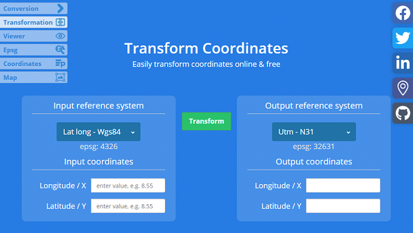

Use the Aspose.GIS for .NET library to transform from any spatial reference system to UTM.

## **Live Example**

Aspose.GIS for .NET presents you online free the ["Convert to UTM"](https://products.aspose.app/gis/transformation/convert-to-utm) application, where you may try to investigate the functionality and quality it works.

## **Code sample - Convert to UTM**

The following code snippet shows you how to convert to UTM for a point.


