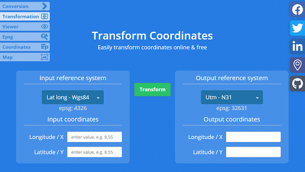

Use the Aspose.GIS for .NET library to transform MERCATOR to UTM.

## **Live Example**

Aspose.GIS for .NET presents you online free the ["MERCATOR to UTM"](https://products.aspose.app/gis/transformation/mercator-to-utm) application, where you may try to investigate the functionality and quality it works.

## **Code sample - Convert MERCATOR to UTM**

The following code snippet shows you how to convert MERCATOR to UTM for a point.


