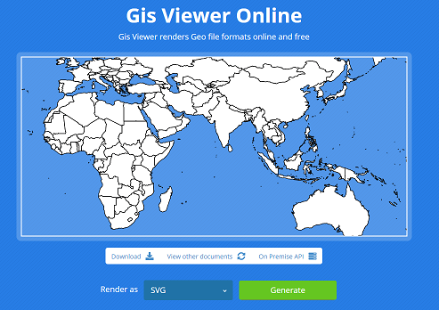

Use the Aspose.GIS for .NET library to implement the GeoJSON to SVG Converter.

## **Live Example**

Aspose.GIS for .NET / C# presents you online free the ["GeoJSON to SVG Converter"](https://products.aspose.app/gis/viewer/geojson-to-svg) application, where you may to investigate the functionality and quality it works.

## **Code sample - GeoJSON to SVG Converter**

The following code snippet shows you how to implement GeoJSON to SVG Converter. The below code create an image map using a GeoJSON layer. Then we save the map to SVG format. If you specify a spatial reference system for the map, all loaded layers will be converted to it. 
The sample uses the specified style to draw lines. The library also has styles for points, lines, and surfaces.



This sample show general possibilities. Aspose.GIS for .NET has wide features to [render maps](https://docs.aspose.com/gis/net/map-rendering/).

## **Platform - .NET / C#**

We supports Framework 4.7 or later under Windows, and .NET Core 2.0 or later under Windows or Linux
