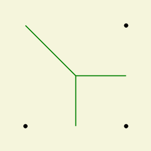
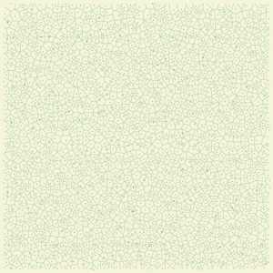

# Voronoi Diagram

A Voronoi Diagram is a simple partition of the plane: given a set of n points (often referred to as sites) you want to create n regions of the plane, one for each point. Those regions are formed such as for each site, any point inside its region is closest to that site than any other site.

GeoTools have a method called "MakeVoronoiGraph" to build a Voronoi diagram for a collection of points. We need to set three or more points, then we get a rectangle (calculating the minimum and maximum of "x" and "y" coordinates for all points) to restrict our plane. As a result, we get a collection of edges forming the Voronoi diagram restricted by our rectangle.

Then, GeoTools have a method called "BuildCenterline" (which is based on the Voronoi Diagram) to get the centerline for a polygon. We need to set a polygon (or a collection of points) which can be with interior rings. Here, as a result, we get a collection of edges forming the Voronoi diagram restricted by the input polygon. This is the main difference between the "MakeVoronoiGraph" and "BuildCenterline" methods. Also, we can set a collection of points; in this case, we build a polygon by these points. In some cases, we can build a polygon in different ways, so for more accuracy, it's better to set the polygon.

And then, GeoTools have a method called "GetCenterlineLength" to get the centerline length. This is the sum of all centerline edges. Here we need to set a polygon (or a collection of points) which can be with interior rings.

## Make Voronoi Graph for 3 points

```csharp
List<Point> sites = new List<Point>
{
    new Point(100, 100),
    new Point(200, 200),
    new Point(200, 100)
};

var edges = Gis.GeoTools.GeometryOperations.MakeVoronoiGraph(sites);
```


## Make Voronoi Graph for 6 points

```csharp
List<Point> sites = new List<Point>();
MultiPoint geometryFromText = (MultiPoint)Geometry.FromText("MULTIPOINT ((320 170), (366 246), (530 230), (530 300), (455 277), (490 160))");
foreach (Point point in geometryFromText)
{
    sites.Add(point);
}
var edges = Gis.GeoTools.GeometryOperations.MakeVoronoiGraph(sites);
```


## Make Voronoi Graph for 2000 random points

```csharp
List<Point> sites = new List<Point>();
var extent = new Extent(0, 0, 4000, 4000);
var points = GeoGenerator.ProducePoints(extent, new PointGeneratorOptions{ Count = 2000, Seed = 1 });
foreach (Point point in points)
{ 
    sites.Add(point);
}
var edges = Gis.GeoTools.GeometryOperations.MakeVoronoiGraph(sites);
```


## Build Centerline and Get Centerline Length for right triangle polygon

```csharp
List<Point> sites = new List<Point>
{
    new Point(100, 100),
    new Point(200, 200),
    new Point(200, 100)
};
Polygon polygon = new Polygon(new LinearRing(sites));
polygon = Gis.GeoTools.GeometryOperations.CloseLinearRing(polygon) as Polygon;

var edges = Gis.GeoTools.GeometryOperations.BuildCenterline(polygon);

var length = Gis.GeoTools.GeometryOperations.GetCenterlineLength(polygon);
```


## Build Centerline for square polygon with interior ring

```csharp
List<Point> exteriorSites = new List<Point>
{
    new Point(0, 300),
    new Point(300, 300),
    new Point(300, 0),
    new Point(0, 0)
};
Polygon polygon = new Polygon(new LinearRing(exteriorSites));
List<Point> interiorSites = new List<Point>
{
    new Point(100, 100),
    new Point(200, 100),
    new Point(200, 200),
    new Point(100, 200)
};
polygon.AddInteriorRing(new LinearRing(interiorSites));
polygon = Gis.GeoTools.GeometryOperations.CloseLinearRing(polygon) as Polygon;

var edges = Gis.GeoTools.GeometryOperations.BuildCenterline(polygon);
```


## Build Centerline and Get Centerline Length for 6 points

```csharp
List<Point> sites = new List<Point>();
MultiPoint geometryFromText = (MultiPoint)Geometry.FromText("MULTIPOINT ((320 170), (366 246), (530 230), (530 300), (455 277), (490 160))");
foreach (Point point in geometryFromText)
{
     sites.Add(point);
}

var edges = Gis.GeoTools.GeometryOperations.BuildCenterline(sites);
var length = Gis.GeoTools.GeometryOperations.GetCenterlineLength(sites);
```
