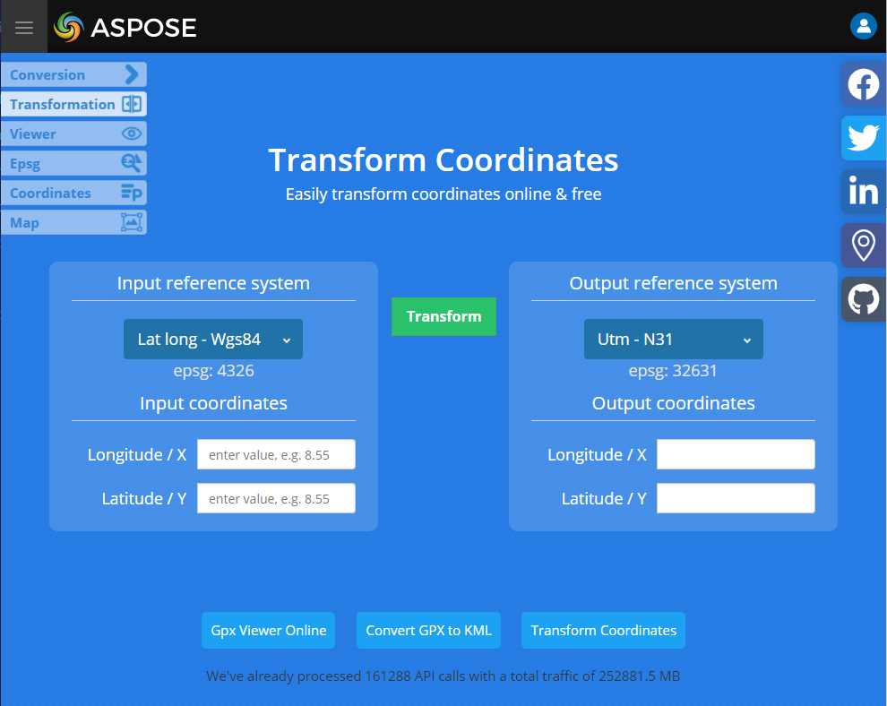

Aspose.GIS API lets you transform LAT LONG to UTM.

## **Live Example**

Aspose.GIS for .NET presents you online free application [�LAT LONG to UTM�](https://products.aspose.app/gis/transformation/lat-long-to-utm), where you may try to investigate the functionality and quality it works.

## **Code sample**

The following code snippet shows you how to convert LAT LONG to UTM for a point.


